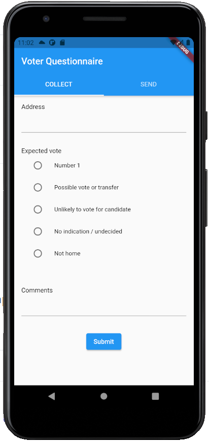
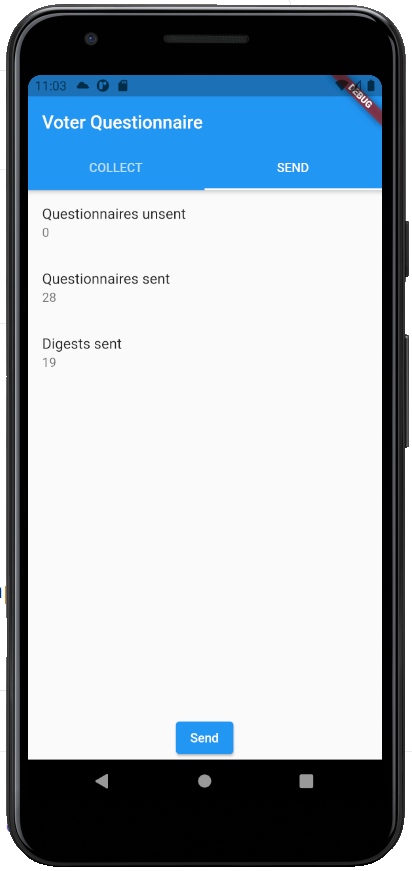
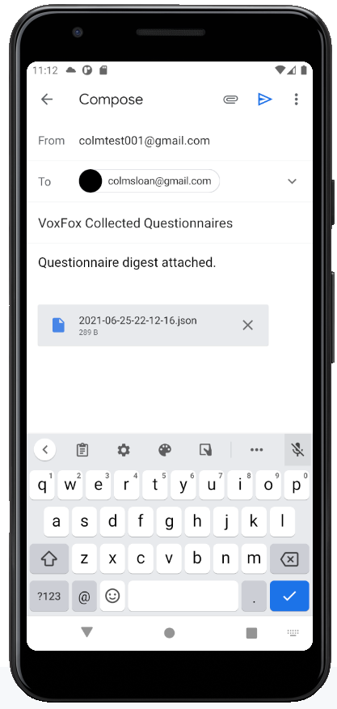

# voxfox

Appified canvassing questionnaire with GPS.
Reports are sent as pre-populated email with JSON attachment.

## Look





## JSON

```json
[
    {
        "id": "097c3c0c-121a-49b5-b7b4-0c439f5575c3",
        "altitude": 77.08515381342913,
        "latitude": 53.3288355,
        "longitude": -6.2509111,
        "timestamp": "2021-06-25T21:38:24.562607Z",
        "questionnaire": [
            {
                "question": "Address",
                "answer": "1 Nice Street"
            },
            {
                "question": "Expected vote",
                "answer": "Possible vote or transfer"
            },
            {
                "question": "Comments",
                "answer": "road works"
            }
        ]
    }
]
```
